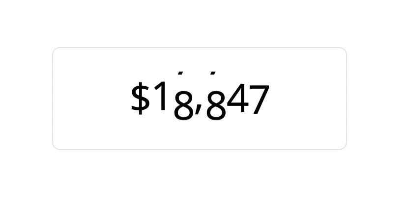

# React Flip Ticker

```
yarn add react-flip-ticker
npm install react-flip-ticker
```

```js
import { Ticker } from "react-flip-ticker";
```

# Migrating to v1

We no longer support `text` as a prop, just put the `text` you wish as your children.
We now also support any character and not just numbers

Number ticker for React Web.



Supply some value as `children`, and a `textClassName`, then start ticking values!

```js
<Ticker textClassName="text">{value}</Ticker>
```

Basic Demo

```tsx
import React, { useState, useEffect } from "react";
import { render } from "react-dom";
import { Ticker } from "react-flip-ticker";

function getRandom(min, max) {
  min = Math.ceil(min);
  max = Math.floor(max);
  return Math.floor(Math.random() * (max - min + 1)) + min;
}

const App = () => {
  const [state, setState] = useState<any>({
    value: getRandom(0, 100000),
  });

  useEffect(() => {
    setInterval(() => {
      setState({
        value: getRandom(0, 100000),
      });
    }, 500);
  }, []);

  return <Ticker textClassName="text">{state.value}</Ticker>;
};

render(<App />, document.getElementById("root"));
```

You can also supply specific `Tick` elements and it will rotate between them.

Advanced Demo

```tsx
import React, { useState, useEffect } from "react";
import { render } from "react-dom";
import { Ticker, Tick } from "react-flip-ticker";

function getRandom(min, max) {
  min = Math.ceil(min);
  max = Math.floor(max);
  return Math.floor(Math.random() * (max - min + 1)) + min;
}

const currencies = ["$", "¥", "€"];

const App = () => {
  const [state, setState] = useState<any>({
    currency: currencies[getRandom(0, 2)],
    value: getRandom(0, 100000),
  });

  useEffect(() => {
    setInterval(() => {
      setState({
        currency: currencies[getRandom(0, 2)],
        value: getRandom(0, 100000),
      });
    }, 500);
  }, []);

  return (
    <Ticker textClassName="text">
      <Tick rotateItems={currencies}>{state.currency}</Tick>
      {state.value.toLocaleString()}
    </Ticker>
  );
};

render(<App />, document.getElementById("root"));
```
