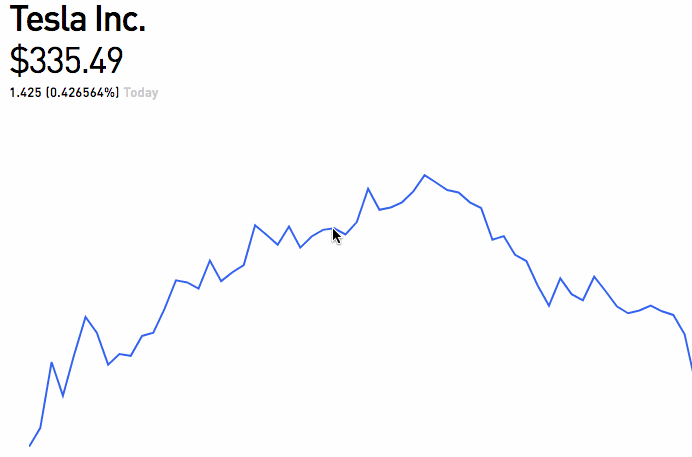

# React Flip Ticker

Number ticker for React Web. Supply some `text`, and a `textClassName`, then start ticking values.



Example:

```js
import React, { Component } from "react";
import Ticker from "react-flip-ticker"

function getRandom(min, max) {
  min = Math.ceil(min);
  max = Math.floor(max);
  return Math.floor(Math.random() * (max - min + 1)) + min;
}

class App extends Component {
  state = {
    value: "123",
  };
  componentDidMount() {
    setInterval(() => {
      this.setState({
        value: getRandom(0, 1000) + "",
      });
    }, 500);
  }

  render() {
    return <Ticker text={this.state.value} textClassName="text" />;
  }
}
```
